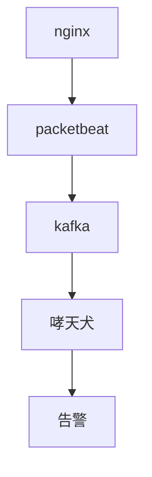
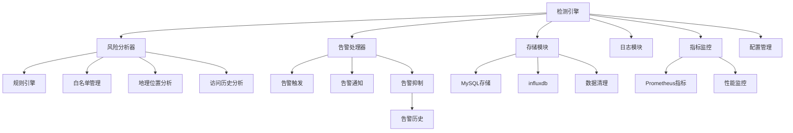

# 哮天犬-敏感数据外泄监测系统

## 适用场景
1. 使用了nginx/openresty反向代理web流量
2. 希望监测nginx外出流量中是否存在获取大量敏感数据（身份证、电话号码等）的异常行为

## 项目架构简述

### 项目整体架构

### 哮天犬系统架构

## 关键特性

1. 多维度风险分析
   
   - IP行为分析
   
   - 时间特征分析
   
   - 地理位置分析
   
   - 历史行为分析

3. 实时处理能力
   
   - 并发处理
   
   - 内存缓存
   
   - 异步通知

5. 可扩展性
   
   - 模块化设计
   
   - 规则可配置
   
   - 指标可监控
   

5. 性能优化
   
   - 白名单前置
   
   - 数据定期清理
   
   - 缓存机制

7. 监控告警
   
   - Prometheus指标
   
   - 告警通知
   
   - 历史记录

## 风险识别策略（基于UEBA；举例，详见代码）
| 检测项               | 规则描述                                                                 | 风险分值 |
|----------------------|--------------------------------------------------------------------------|----------|
| 操作时间点           | 22点-7点及周末获取的数据量>x，节假日白名单IP获取的数据量超过M*x          | +5       |
| 高配切换检测         | 同一个用户指纹在60分钟内使用的IP>2                                       | +3       |
| IP检测           | 常用IP与当前操作IP的地理偏差>300km                                       | +4       |
| 代理特征             | 检测到X-Forwarded-For头或已知代理服务器IP                                | +4       |
| 历史行为             | 该IP过去24小时内触发过≥3次中高风险事件                                   | +6       |
| 跨地域关联检测       | 非中国大陆IP                                                             | +8       |
| IP归属               | 已知数据中心/云服务商IP段-通过ASN数据库                                  | +8       |

## 使用方法
1. 部署nginx代理服务器、kafka、mysql、influxdb
   - nginx站点的反向代理需设置以下两个参数:
     >  proxy_set_header X-Real-IP $remote_addr;
		proxy_set_header X-Forwarded-For $proxy_add_x_forwarded_for;
     > 
3. 修改config/config.yaml中的配置信息
4. 在nginx反向代理服务器部署packetbeat，使用scripts中的packetbeat.yml启动packetbeat
   - 注意修改packetbeat.yml中的“port”为后端的web端口
   - packetbeat -c packetbeat.yml run #测试环境
   - ![packetbeat配置参数][https://www.elastic.co/guide/en/beats/packetbeat/current/configuration-general-options.html]
   - 启动后，注意观察packetbeat对web服务器造成的压力，经过实测，8c16G的配置中，业务1k QPS左右时，packetbeat对web服务器造成的压力可以忽略。但，**建议限制packetbeat的cpu使用率** 。
6. 使用kafka gui工具观察topic是否有数据进入（默认topic名为 beats）
7. 使用go run main.go 启动哮天犬系统，使用tail -f log/app.log 观察日志输出。
8. 本项目暂未考虑性能优化等，欢迎大家提交PR优化代码，增加web大盘以及各种风险策略等。
   
