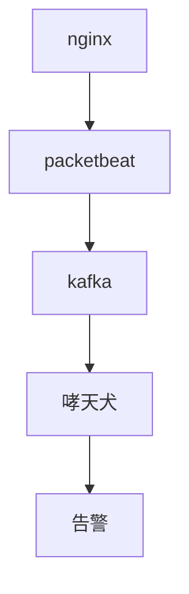
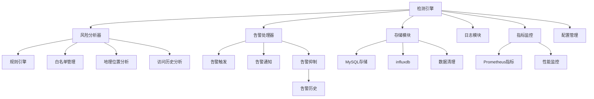

# 哮天犬-敏感数据外泄监测系统

## 适用场景
1. 使用了nginx/openresty反向代理web流量
2. 希望监测nginx外出流量中是否存在获取大量敏感数据（身份证、电话号码等）的异常行为

## 项目架构简述

### 项目整体架构

### 哮天犬系统架构

## 关键特性

1. 多维度风险分析
   
   - IP行为分析
   - 时间特征分析
   - 地理位置分析
   - 历史行为分析

2. 实时处理能力
   
   - 并发处理
   - 内存缓存
   - 异步通知

3. 可扩展性
   
   - 模块化设计
   - 规则可配置
   - 指标可监控

4. 性能优化
   
   - 白名单前置
   - 数据定期清理
   - 缓存机制

5. 监控告警
   
   - Prometheus指标
   - 告警通知
   - 历史记录

## 风险识别策略
| 检测项               | 规则描述                                                                 | 风险分值 |
|----------------------|--------------------------------------------------------------------------|----------|
| 累计数据下载量       | 单会话（cookie）在10分钟、60分钟、4小时窗口时间内获取的数据量超过N       | +4       |
| 操作时间点           | 22点-7点及周末获取的数据量>x，节假日白名单IP获取的数据量超过M*x          | +5       |
| 高配切换检测         | 同一个用户指纹在60分钟内使用的IP>2                                       | +3       |
| 登录IP检测           | 常用IP与当前操作IP的地理偏差>300km                                       | +4       |
| 代理特征             | 检测到X-Forwarded-For头或已知代理服务器IP                                | +4       |
| 历史行为             | 该IP过去24小时内触发过≥3次中高风险事件                                   | +6       |
| 跨地域关联检测       | 非中国大陆IP                                                             | +8       |
| IP归属               | 已知数据中心/云服务商IP段-通过ASN数据库                                  | +8       |

   
